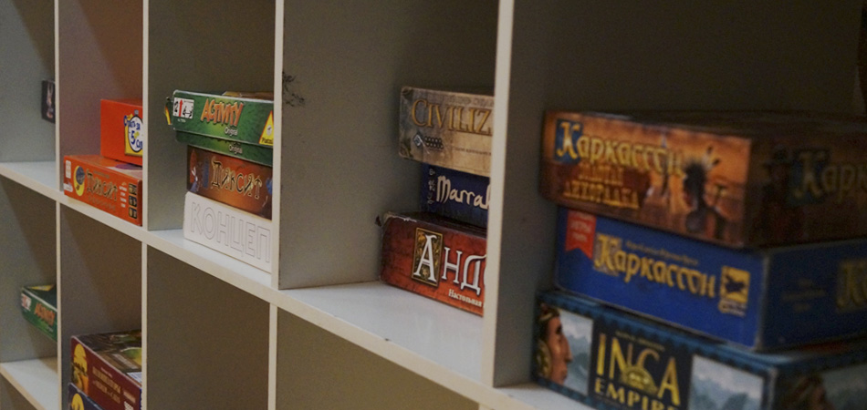

# Настольные игры

## По популярности (ТОП-10 игр)

1. [Alias](alias.md)
2. [Activity](activity.md)
3. Doble
4. Манчкин
5. Set
6. DixiT
7. Иммаджинариум
8. Ticket to ride
9. Колонизаторы
10. Ответь за 5 секунд! (Новинка)

## По алфавиту
1.	7 Wonders
2.	Андор
3.	Блиц
4.	Бонанза
5.	Бонанза. На Диком Западе
6.	Бонанза. Бонапарт
7.	Бэнг
8.	Держу Пари
9.	Запретный Остров
10.	Затерянные Города
11.	Зельеваренье
12.	Игра Престолов
13.	Имаджинариум
14.	Инновация
15.	Каркассон
16.	Каркассон. Золотая Лихорадка
17.	Карты
18.	Колонизаторы
19.	Колонизаторы.Первопроходцы и пираты
20.	Концепт
21.	Корова 006
22.	Маленький Принц
23.	Мамма Миа
24.	Манчкин. Классический
25.	Манчкин. Звездный
26.	Манчкин. Легендарный
27.	Манчкин Quest
28.	Мафия
29.	Мертвый Сезон: Перекрестки
30.	Монополия. Всемирное Издание
31.	Монополия. Миллионер
32.	Ответь за 5 секунд!
33.	Покер
34.	Помидорный Джо
35.	Свинтус
36.	Тик Так Бум
37.	Ужас Аркхэма
38.	Цитадели
39.	Шакал
40.	Шахматы
41.	Шашки
42.	Activity
43.	Activity +18
44.	[Alias](alias.md)
45.	Civilization
46.	DixiT
47.	Doble
48.	Dominion
49.	Evolution
50.	Flux
51.	Inca Empire
52.	Inside
53.	Jungle Speed
54.	Katamino
55.	Marrakech
56.	Mr.Jack
57.	Painc at the Lab
58.	Revolver
59.	Scrubble
60.	Set
61.	Smallworld
62.	Ticket to Ride. Классика
63.	Ticket to Ride. Европа
64.	Timeline. Изобретения
65.	Timeline. Избранное
66.	Uno

## По категориям
1. Карточные игры
2. «Игры с доской»
3. Игры с кубиками
4. Настольные ролевые игры, или разговорные ролевые игры
5. Игры на бумаге

### Возраст

#### с 8 лет

1. Katamino
2. Шахматы
3. Шашки
4. Set
5. Свинтус
6. Doble
7. Scrubble
8. Uno
9. Jungle Speed
10. Каркассон
11. Каркассон. Золотая Лихорадка
12. Мамма Миа
13. Inside
14. Блиц
15. Запретный Остров
16. Корова 006
17. Маленький Принц
18. Монополия. Всемирное Издание
19. Монополия. Миллионер
20. Помидорный Джо
21. Тик Так Бум
22. Шакал
23. Dominion
24. Flux
25. Marrakech
26. Smallworld
27. Ticket to Ride. Классика
28. Ticket to Ride. Европа
29. Timeline. Изобретения
30. Timeline. Избранное
31. Ответь за 5 секунд!
32. DixiT
33. Мафия
34. Mr.Jack
35. 7 Wonders
36. Андор
37. Затерянные Города
38. Зельеваренье
39. Манчкин Quest
40. Цитадели
41. Painc at the Lab
42. Бонанза
43. Бонанза. На Диком Западе
44. Бонанза. Бонапарт
45. Колонизаторы
46. Колонизаторы.Первопроходцы и пираты
47. Держу Пари
48. Концепт
49. [Alias](alias.md)
50. Evolution

#### с 12 лет

1. Revolver
2. Inca Empire
3. Манчкин. Классический
4. Манчкин. Звездный
5. Манчкин. Легендарный
6. Бэнг
7. Ужас Аркхэма

#### для старших возрастных категорий

1. Activity
2. Civilization
3. Инновация
4. Мертвый Сезон: Перекрестки
5. Игра Престолов
6. Карты
7. Имаджинариум
8. Покер
9. Activity +18

### Количество игроков

#### На двоих

1. Шахматы
2. Шашки
3. Mr.Jack
4. Painc at the Lab
5. Revolver

#### на 2-3 игроков

1. Katamino
2. Inside
3. Шашки
4. Mr.Jack
5. Painc at the Lab
6. Шахматы
7. Revolver

#### до 5 игроков

1. Marrakech
2. Блиц
3. Scrubble
4. Затерянные Города
5. Dominion
6. Андор
7. Инновация
8. Манчкин Quest
9. Civilization
10. Запретный Остров
11. Монополия. Всемирное Издание
12. Монополия. Миллионер
13. Inca Empire
14. Колонизаторы
15. Колонизаторы.Первопроходцы и пираты
16. Мертвый Сезон: Перекрестки
17. Маленький Принц
18. Мамма Миа
19. Smallworld
20. Помидорный Джо
21. Ticket to Ride. Классика
22. Ticket to Ride. Европа
23. Каркассон
24. Каркассон. Золотая Лихорадка

#### до 8 игроков

1. Flux
2. Свинтус
3. Шакал
4. Зельеваренье
5. Evolution
6. Ответь за 5 секунд!
7. DixiT
9. 8. Игра Престолов
10. Манчкин. Классический
11. Манчкин. Звездный
12. Манчкин. Легендарный
13. 7 Wonders
14. Бонанза
15. Бонанза. На Диком Западе
16. Бонанза. Бонапарт
17. Бэнг
18. Имаджинариум
19. Карты
20. Set
21. Ужас Аркхэма
22. Doble
23. Timeline. Изобретения
24. Timeline. Избранное
25. Uno
26. Цитадели
27. Jungle Speed
28. Покер
29. Корова 006
30. Тик Так Бум
31. Концепт
#### до 12 игроков

1. Корова 006
2. Тик Так Бум
3. Концепт

#### более 12 игроков

1. Тик Так Бум
2. Концепт
3. Activity
4. Activity +18
5. [Alias](alias.md)
6. Держу Пари
7. Мафия

### Длительность игры

#### до 10 минут

1. Doble
2. Карты
3. Свинтус

#### до 30 минут

1. Katamino
2. Inside
3. Шашки
4. Flux
5. Uno
6. Ответь за 5 секунд!

#### до 60 минут

1. Set
2. Marrakech
3. Маленький Принц
4. Помидорный Джо
5. Timeline. Изобретения
6. Timeline. Избранное
7. Тик Так Бум
8. Jungle Speed
9. Бэнг
10. Держу Пари
11. Painc at the Lab
12. Mr.Jack
13. Scrubble
14. Блиц
15. Запретный Остров
16. Монополия. Всемирное Издание
17. Монополия. Миллионер
18. Затерянные Города
19. Каркассон
20. Каркассон. Золотая Лихорадка
21. Мамма Миа
22. Ticket to Ride. Классика
23. Ticket to Ride. Европа
24. Шакал
25. Корова 006
26. DixiT
27. Activity
28. Activity +18
29. Имаджинариум
30. Концепт
31. [Alias](alias.md)

#### от часа и более

1. Андор
2. Инновация
3. Бонанза
4. Бонанза. На Диком Западе
5. Бонанза. Бонапарт
6. Мертвый Сезон: Перекрестки
7. Манчкин Quest
8. Цитадели
9. Inca Empire
10. Ужас Аркхэма
11. Civilization
12. Игра Престолов
### Сложность правил

#### очень простые правила

1. Flux
2. Doble
3. Карты
4. Свинтус
5. Шашки
6. Timeline. Изобретения
7. Timeline. Избранное
8. Katamino
9. Uno
10. Ответь за 5 секунд!
11. Set
12. Marrakech
13. Тик Так Бум
14. Jungle Speed
15. Бэнг
16. Activity
17. Activity +18
18. [Alias](alias.md)
19. Маленький Принц
20. Держу Пари
21. Блиц
22. Мамма Миа
23. Корова 006
24. DixiT
25. Имаджинариум
26. Scrubble
27. Концепт
28. Мафия
#### изучение правил требует некоторого времени

1. Inside
2. Помидорный Джо
3. Painc at the Lab
4. Запретный Остров
5. Ticket to Ride. Классика
6. Ticket to Ride. Европа
7. Шакал
8. Манчкин. Классический
9. Манчкин. Звездный
10. Манчкин. Легендарный
11. Каркассон
12. Каркассон. Золотая Лихорадка
13. Монополия. Всемирное Издание
14. Монополия. Миллионер
15. Зельеваренье
16. Evolution
17. Шахматы
18. Покер
19. Revolver
20. Колонизаторы
21. Колонизаторы.Первопроходцы и пираты
22. Бонанза
23. Бонанза. На Диком Западе
24. Бонанза. Бонапарт

#### сложные правила

1. Mr.Jack
2. Затерянные Города
3. Dominion
4. Smallworld
5. 7 Wonders
6. Андор
7. Инновация
8. Мертвый Сезон: Перекрестки
9. Манчкин Quest
10. Цитадели
11. Inca Empire
12. Ужас Аркхэма
13. Civilization
14. Игра Престолов