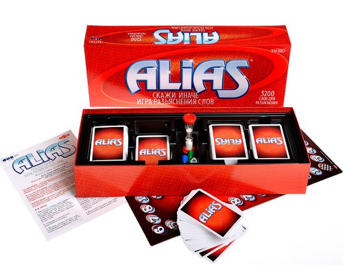

# Alias

Игра разъяснения слов 

Не менее 4 игроков от 7 лет и старше.

Игра включает: игровую доску, песочные часы, 6 фишек и 400 карточек со словами.

  
**Правила:**

Скажем иначе — игра разъяснения слов, в которой принимают участие команды, состоящие из двух человек. Минимальное количество игроков 4 человека, максимальному предела нет. 
В игре «Скажи иначе» надо суметь объяснить другими словами разгадываемое слово. То есть задачей является, с определёнными ограничениями!! и с помощью объяснений, синонимов, антонимов и намёков, достичь того, чтобы компаньоны по игре отгадали как можно больше указанных в карточке слов. Команда, которая подойдёт к финишу первой, становится победителем. 
«Скажи иначе» предлагает самый веселый в мире способ для упражнения иностранным языком, если игроки договорятся о ведении игры на английском, немецком или каком-то другом языке. 
  
**Ход  игры**

Карточки со словами перемешиваются и складываются в ячейки коробки. Последнюю карточку каждой колоды переворачивают. Это делается для того, чтобы в свое время увидеть, что вся колода сыграна и после этого перемешать колоду снова. Очередность ведения игры разыгрывается игроками. Команда, которая начинает игру, договаривается между собой, кто из членов команды объясняет, а кто разгадывает. Разъясняющий берет определенное количество карточек в руки (15–20 шт.), а остальные члены команды задают ему какой-либо номер от 1 до 8, (номер слова на карточке), например 4. После каждого правильно отгаданного слова он кладет эту карточку на стол и начинает разъяснять слово под номером 4 со следующей карточки. Когда песок в песочных часах стечёт вниз, остальные команды кричат «пиип» 
  
Минусовые шаги за ошибки

Если разъясняющий сделает ошибку в своем разъяснении, то ответ не зачитывается и команда получает за это штраф в виде одного минусового шага. 
  
Пример

Если команда разгадала 6 слов правильно и среди них в разъяснении было 2 ошибки, то команда передвигает свою фишку вперед на 6, минус 2 шага. То есть в итоге продвигается вперед на 4шага. Остальные играющие должны быть внимательными. 
Если попадается трудно объяснимое слово, то разъясняющий может его не разъяснять, а перейти к другой карточке, но за это он тоже платит минусовым шагом. Иногда это стоит делать. 
  
Право на «Грабеж»

Когда команда пройдет мимо любого из темных квадратов, то в следующем туре игры ей придется бороться за свои слова с другими командами, у которых имеется право на «грабеж». К «грабежу» приступают даже в том случае, если команда не остановилась на темном квадрате, а просто прошла мимо него. Остальные команды должны следить за тем, чтобы «грабеж» был сыгран. «Грабёж» играется без песочных часов. Команда берет 6 карточек, из которых отгадываются слова, соответствующие номеру квадрата под фишкой команды. Разгадывают все. Команда, первая выкрикнувшая правильный ответ, продвигает свою фишку на 1 ход вперед. При разгадывании последнего слова право на «грабеж» всегда в силе. 
Если команда проходит мимо темного квадрата ходами, заработанными «грабежом», то в этом случае она продолжает нормальную игру с песочными часами. «Грабёж» не играется. 
«Скажи иначе» — помощник в упражнении иностранным языком. 
Колее приятного способа для упражнения иностранным языком, как играть в игру «Скажи иначе», например на английском, немецком или испанском языке — нет. Разъясняющий должен при такой игре объяснять только на иностранном языке, отгадывать можно на русском. Если он знает, что «песок» по-английски «sand», то он может сказать прямой перевод этого слова, если не знает, то он должен его объяснить только по-английски. Играя все напряжения исчезают и находятся новые слова. И поскольку слова разгадываются по-русски, то богатство или бедность словарного запаса не мешает игре. Незаметно в ходе игры улучшается знание языка и разговорная находчивость Теперь и эти команды могут принять участие к разгадывании слова. Самый быстрый побеждает: кто угодно из игроков может, отгадав слово правильно, продвинуть свою команду на 1 ход вперед по игровой доске, так сказать «ограбить» других. 
Кода и последнее слово будет разгадано, команда подсчитывает количество правильно разгаданных слов по карточкам, сложенным на стол. Если их, например, 7 штук, то команда имеет право продвинуться по игровой доске на 7 шагов вперед, (если 10, то на 10 шагов) (см. Минусовые шаги за ошибки). 
Теперь начинает разгадывать следующая команда. Разъясняющий первой команды укладывает использованные карточки в отдельное место, а неиспользованные карточки отдаёт разъясняющему следующей команды, который берёт ещё на всякий случай несколько карточек сверху колоды. Разъяснение проходит быстрее, когда карточки в руках. 
После первого тура игры номер разъясняемых слов виден на игровой доске. Квадраты доски пронумерованы от 1 до 8. Тот квадрат, на котором находится фишка команды, определяет номер разъясняемого слова. 
Разъясняющий меняется в каждом туре игры. 
Команда, которая подойдет к финишу первой, становится победителем. 
Слова в карточках находятся в произвольном порядке, в них есть глаголы, прилагательные, существительные, имена, наименования мест, цвета и т. д. В этом смысле номера от 1 до 8 не имеют значения. Зависит от удачи, какие слова попадутся команде: легкие или трудные. 
Только  точно разгаданные ответы одобряться. 
Слово всегда надо отгадать точно, в правильной форме. Если правильное слово, например, «зашивать», то «шить» не одобряется. Разъясняющий должен помочь разгадывающему найти правильную форму этого слова. Также, если разгадываемое слово должно быть «острый», то недостаточно сказать «острая». Окончание должно быть правильным. 
  
Правила касающиеся разъяснений

При разъяснении нельзя использовать части разгадываемого слова, а также однокоренные слова. Например, слово «автобус» нельзя объяснить так, что речь идет об автомобильном транспортном средстве. Надо сказать, что это маршрутное транспортное средство. Слово «самолет» нельзя разъяснять так, что это в небе летающее средство передвижения, потому что в словах «летающее» и «самолет» один и тот же корень. Если в таких словах, как например «дистанционное управление» отгадывающий отгадает слово «управление», то разъясняющий после этого может пользоваться в своем разъяснении этим словом. Также можно пользоваться синонимами и антонимами . Например слово «большой» можно сказать, что это антоним слова «маленький». Если игра ведется на русском языке, то слово нельзя разъяснять на иностранном языке. Нельзя сказать по-английски big.  Говорить можно так быстро, как можешь, все время дополняя 
  
Сокращенные правила игры

Команды играют поочередно. Разъясняющий команды меняется в каждом туре. Количество разгаданных слов — шаги вперед по игровой доске. 
Сделанные ошибки и оставшиеся необъясненными слова — минусовые шаги. 
Квадрат, на котором стоит фишка команды, указывает номер разъясняемого слова. В первом туре команды разыгрывают начинающего. 
Проход мимо темного квадрата говорит о праве на «грабёж» с 6 карточками без песочных часов. 
Команда, которая придет к финишу первой выигрывает.